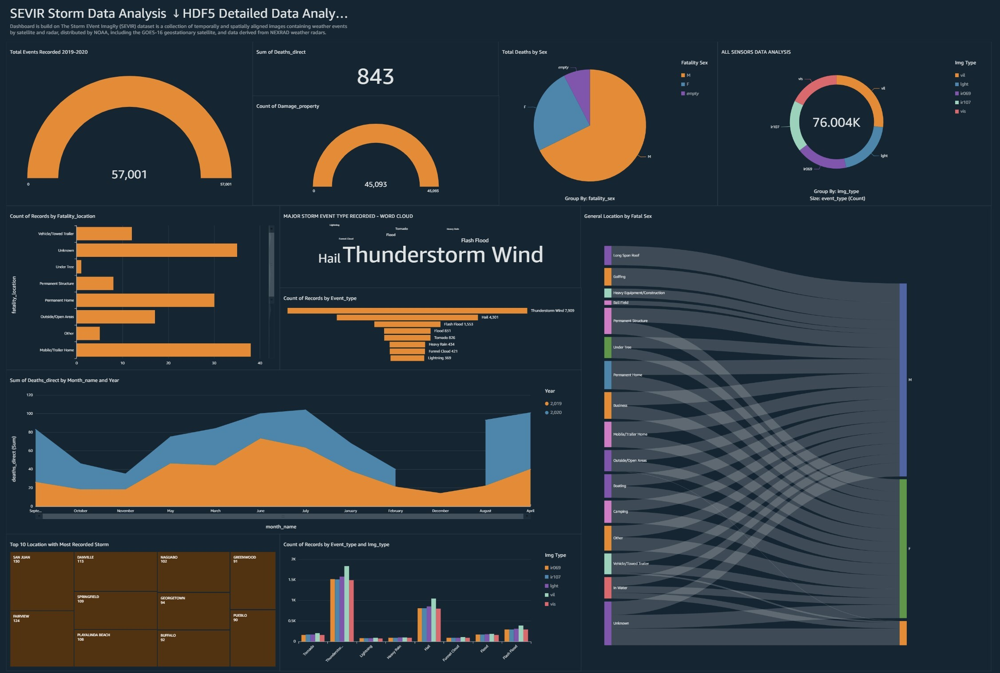

# MIT_Research_SEVIR_Data_Architecture


# CSYE7245 - SEVIR AWS ARCHITECTURE


[](https://www.python.org/)

**Team Members**<br />
Akash M Dubey <br />
Jayshil Jain <br />
Sagar Shah <br />

#### Quick Links

##### Presentations <br />
[Presentation](https://docs.google.com/document/d/1lazIbEe9S3NOoDNHNNhBujKwwu4JMAiNEUhc0Jr0onM/edit#heading=h.ejimkgfvmpx9)<br />
[CLAAT presentation](
https://codelabs-preview.appspot.com/?file_id=1lazIbEe9S3NOoDNHNNhBujKwwu4JMAiNEUhc0Jr0onM#0)<br />

---

## Table of Contents

- [Introduction](#introduction)
- [Architecture](#architecture)
- [Setup](#setup) 


## Introduction

Sevir AWS Data Architecture is build to make sample SEVIR data available for everyone with detailed analysis, 


SEVIR AWS Architecture supports end to end cycle, right from copying the data from Public S3 sevir data to final analysis on AWS Quicksight, Data flows right from public s3 buckets to user's further user capabilities to download, view and upload other files via locally hosted flask application. Once sample of S3 buckets are into respective S3 buckets, they are fed into ETL glue which builts crawlers and jobs to build the data flow into AWS Redshift Cluster and later fed into SPICE storage by QUICKSIGHT for building visualizations. 


#### Dataset overview: 

The Storm EVent ImagRy (SEVIR) dataset is a collection of temporally and spatially aligned images containing weather events captured by satellite and radar. This dataset was created using publically available datasets distributed by NOAA, including the GOES-16 geostationary satellite, and data derived from NEXRAD weather radars, both of which are available on the Registry of Open Data on AWS

## Architecture 


---


## Overview of Requirements- Setup 

The pipeline requires an Amazon Web Services account to deploy and run. Signup for an AWS Account [here](https://portal.aws.amazon.com/billing/signup#/start). The pipeline uses the folllowing AWS Services & components :

- S3
- AWS Glue
- Glue Crawlers 
- AWS Glue Jobs
- Athena
- Redshift 
- Quicksight
- Spice by Quicksight 
- Locally hosted Flask App 

Create a new role on the AWS IAM Console and upload the policy template found at `aws_config/policy.json` on this repository to allow access to all required AWS Services

### Clone

Clone this repo to your local machine using `https://github.com/akash/AWSARCHITECHTURE.git` 
 
### Setup Flask web App for performing S3 operations 

Follow instructions below to setup locally your own Flask Application<br />
[Locally configured on http://127.0.0.1:5000/ | WebApp](http://127.0.0.1:5000/)<br /> 

Creating a virtual environment is recommended.
Creating virtual environment using Python 3 installed with Homebrew:
```shell
virtualenv -p python3 venv --always-copy
source venv/bin/activate
```

Install Dependencies

```shell
pip install -r requirements.txt
```

#### Configuration for Local Flask App 

Create a new file `.env` using the contents of `.env-sample`.
If you are not using the AWS CLI, modify the placeholders to add your AWS credentials and bucket name.


#### Flask Application Function & Run commands - SEVIR UI <br />
> :warning: The instance is hosted locally

 The Flask based Web Application serves as a UI to enable user perform : 

 1. View Files from S3 bucket 
 2. Upload files from Local to S3 buckets 
 3. Download files from s3 buckets to local directory
 4. Copy sample Data (20 GB) directly into s3 buckets  ( Fastest way to have data into S3 )

#### Post Setup, Run Instructions for Flash :- SEVIR UI <br />
 
  1. Once configure, versed with functions;  run 'app.py' to start the Flask Application  which should now be running on `localhost:5000` 
  2. Incase of any errors on the port, use following commands to identify port and kill current process on port 

 ``` sudo lsof -i :5000
sudo kill -9 {pid}
``` 
  3. Once Flask App is running, use console to transfer S3 files from public bucket to our bucket and for other utilies 


Data flow End result : Flask App will migrate Data into S3 buckets 

### Configuration for AWS Services 

##### AWS Redshift Configuration - Target Technology Stack <br /> 

 Once we have data in our S3 buckets, it necessary for us to build Redshift cluster to work as a destination for our data flow and serve as a storage module  

 1.  To create an Amazon Redshift cluster , Sign in to the AWS Management Console and open the Amazon Redshift console at https://console.aws.amazon.com/redshift/
 2.  At upper right, choose the AWS Region in which you want to create the cluster.
 3.  On the navigation menu, choose CLUSTERS, then choose Create cluster. The Create cluster page appears.
 4.  In the Cluster configuration section, specify values for Cluster identifier, Node type, and Nodes
    Choose Node type: dc2.large with Nodes: 2 for this Architecture setup.
 5.  In the Database configurations section, specify values for Database name (optional), Database port          (optional), Master user name, and Master user password.
 6.  In the Cluster permissions section, for Available IAM roles choose the IAM role that you previously created, myRedshiftRole. Then choose Associate IAM role.
 7.  In the Additional configurations section, turn off Use defaults to modify Network and security, Database configurations, Maintenance, Monitoring, and Backup settings.
 8.  Create Cluster and Run Scripts present at SQL folder in this repository 


More references: https://docs.aws.amazon.com/redshift/latest/gsg/rs-gsg-launch-sample-cluster.html 

##### AWS ETL Glue Configuration - ETL Module <br /> 
The pipeline extensively uses AWS GLUE as an ETL service for Data migrations: 

A] Build connections 
    1. In the AWS Glue Data Catalog, add a connection for Amazon Redshift.	
    2. Create and attach an IAM service role for AWS Glue to access Amazon Redshift and S3 buckets.	
    3. Test the connections for Redshift Cluster 

    References : https://docs.aws.amazon.com/glue/latest/dg/connection-using.html

    Endresult: Successful connections to Redshift & S3 

    Note: One possible challenge you could face is connecting your Redshift cluster to Glue; 
    make sure to define new security group and then define a private vpc endpoint allowing all TCP/ IP , then add Glue's endpoint to same VPC.
    This will establish Private Gateway building successful connection in Private Redshift Cluster & Glue Service 

B]. Setup Multiple GLUE CRAWLERS: 

    1. In the AWS Glue Data Catalog, Create each Crawlers for each Amazon Redshift schema , in this process, create new table to store meta data from Redshift (Target Schema)
    2. In the AWS Glue Data Catalog, Create Crawlers for S3 buckets, in this process, create new table to store meta data from S3  (Source Schema)
    3. Run all Crawlers 
  
    Reference : https://docs.aws.amazon.com/glue/latest/dg/add-crawler.html 

    End result: Each crawler should result in defining meta data schema 
  

C]. Setup Multiple GLUE ETL Spark JOBS: 

    1. In the AWS Glue, Create each JOB for each Amazon Redshift schema, in this process, choose the same IAM policy used while creating crawler  (Target Schema)
    2. While building jobs, Define the source through Metadata (generated through running crawler) 
    3. Define the target redshift using the metadata available through crawler 
    4. Use the spark scripts under folder ETL Jobs   
    5. Run all '%S3toRedshift' Jobs;  

    More Reference: https://docs.aws.amazon.com/glue/latest/dg/author-job.html
    
    End Result: Each Job process ETL functions,
     it [Extracts] the data from S3 files , objects and applying [Transformation] for each schema ( source S3) to Target destination ( target Redshift ) and then finally [Loads] the Processed Data into Redshift Cluster


D] Querying on Athena : 


#### Setup QuickSight 

    1. For Amazon QuickSight to connect to an Amazon Redshift instance, you must create a new security group for that instance. This security group contains an inbound rule authorizing access from the appropriate IP address range for the Amazon QuickSight servers in that AWS Region. To learn more about authorizing Amazon QuickSight connections, see Manually Enabling Access to an Amazon Redshift Cluster in a VPC or Manually Enabling Access to an Amazon Redshift Cluster That Is Not in a VPC.

    2. Check Data Source Quotas to make sure your target table or query doesn't exceed data source limits.
    3. Confirm that the database credentials you plan to use have appropriate permissions as described in Required Permissions
    4. Make sure you have configured the cluster or instance for Amazon QuickSight access by following the instructions in Network and Database Configuration Requirements.
    5. On the Amazon QuickSight start page, choose Manage data.
    6. In the FROM NEW DATA SOURCES section of the Create a Data Set page, choose either the RDS or the Redshift Auto-discovered icon, depending on the AWS service you want to connect to.
    7. Enter the connection information for the data source, as follows:

              - For Data source name, type a name for the data source.

              - For Instance ID, choose the name of the instance or cluster you want to connect to.

              - Database name shows the default database for the Instance ID cluster or instance. If you want to use a different database on that cluster or instance, type its name.

              - For Username, type the user name of an account that has permissions to access the target database, and also to read (perform a SELECT statement on) any tables in that database that you want to use.

              - For Password, type the password associated with the user account you entered.

    8. Once Redshift is configured start with Migration of sample data into SPICE storage by Quicksight

    9 . When you import data into a dataset rather than using a direct SQL query, it becomes SPICE data because of how it's stored. SPICE is the Amazon QuickSight Super-fast, Parallel, In-memory Calculation Engine. It's engineered to rapidly perform advanced calculations and serve data. In Enterprise edition, data stored in SPICE is encrypted at rest.

    10. When you create or edit a dataset, if you choose SPICE or a direct query, unless the dataset contains uploaded files. Importing (also called ingesting) your data into SPICE can save time and money:

            - Your analytical queries process faster.

            - You don't need to wait for a direct query to process.

            - Data stored in SPICE can be reused multiple times without incurring additional costs. If you use a data source that charges per query, you're charged for querying the data when you first create the dataset and later when you refresh the dataset.


     More References: https://docs.aws.amazon.com/quicksight/latest/user/enabling-access-redshift.html


 
### Final Analysis on Quicksight  
   Quicksight dashboard

