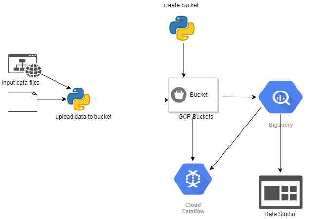
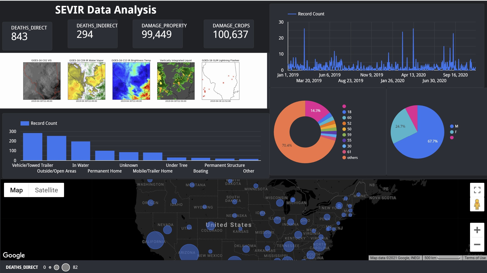

# CSYE7245 – SEVIR GCP Architecture (Part2)


[](https://www.python.org/)

**Team Members**<br />
Akash M Dubey <br />
Jayshil Jain <br />
Sagar Shah <br />

#### Quick Links

##### CodeLabs <br />
[CodeLabs]( https://codelabs-preview.appspot.com/?file_id=1a9w5mGsa2gDE7SacxhMDSoqcSFyNDxZrlYQYGd5KjPY#0)
<br />

##### Documentation <br />
[Google Doc](https://docs.google.com/document/d/1a9w5mGsa2gDE7SacxhMDSoqcSFyNDxZrlYQYGd5KjPY/edit?usp=sharing)
<br />


---

## Table of Contents

- [Introduction](#introduction)
- [Architecture](#Architecture)
- [Setup](#setup)


## Introduction

Scalable Data Pipeline for analyzing SEVIR dataset using GCP
- Download sample datasets and move it to Google storage buckets
- Experiment with Google Dataflow and build a pipeline
- Show how Google Bigquery and Data studio to query and sample datasets

## Architecture 

         

---


## Setup

The pipeline requires an GCP Service account to deploy and run. Signup for an GCP Account [here]( https://cloud.google.com/). The pipeline uses the folllowing GCP Services:

- GCP Storage buckets 
- Google Dataflow
- Google Bigquery
- Google Data studio


Create a new service account on GCP:-
1)	Go to website and register to create acc: https://cloud.google.com/
2)	Login to Google Cloud Console and navigate to Service Accounts in IAM & admin section.
3)	Click on "CREATE SERVICE ACCOUNT"
4)	Provide Service account details and Click "CREATE"
5)	In Service account permissions , select a role from dropdown for the development purpose choose "Project Editor", in production environment role should be provided according to the principle of least privilege
6)	Click "CONTINUE"
7)	Click "CREATE KEY" and choose type "json", keys would be downloaded to the local machine
8)	Click "DONE"
9)	Create a folder with name ".config" in users home directory and save downloaded key in ".config or else save in the folder location of your project 


### Clone

Clone this repo to your local machine using `https://github.com/sagarshah95/GCP-Architecture-SEVIR.git` 

### Install all the required packages and libraries before executing the python scripts:-

```
pip install google-cloud-storage
pip install gcloud
pip install google-api-python-client
pip install google-cloud-storage

All scripts make use of the json credentials downloaded for the GCP account

```

### Creating GCP storage buckets 

In order to upload data and access it through GCP we create GCP storage buckets. Navigate to create_GCP_bucket.py file and run the command in CMD:-

```
run python
run python create_GCP_bucket.py 
```

#### Uploading data to GCP storage buckets
Scraping storm data from https://www1.ncdc.noaa.gov/pub/data/swdi/stormevents/csvfiles/ website and uploading it to GCP storage bucket created along with cataloge.csv/sevir.csv, for this purpose navigate to file upload_data_GCP_buckets.py and run the command in the CMD:-

```
run python
run python upload_data_GCP_buckets.py
```

### Downloading files from GCP storage buckets 

In order to download data from GCP storage buckets. Navigate to create_GCP_bucket.py download_file_GCP_bucket.py file and run the command in CMD:-

```
run python
run python download_file_GCP_bucket.py
```

### Read contents of CSV files from GCP storage buckets into dataframe 

In order to read contents of CSV files from GCP storage buckets into dataframe navigate to read_contents_GCP_buckets.py file and run the command in CMD:-

```
run python
run python read_contents_GCP_buckets.py
```

### Delete files from GCP storage buckets

In order to delete files from GCP storage buckets
navigate to delete_files_GCP_bucket.py file and run the command in CMD:-

```
run python
run python delete_files_GCP_bucket.py
```

### Connecting Google BigQuery to GCP Storage buckets 
 
Follow the steps below to connect Google BigQuery to GCP storage buckets and create tables for querying :-
1)	Follow the link to connect GCP Buckets to BigQuery: https://cloud.google.com/bigquery/external-data-cloud-storage
2)	Follow the link to load csv data to BigQuery for creating Tables: https://cloud.google.com/bigquery/docs/loading-data-cloud-storage-csv


### Google Data studio for visualizations
 
Google Data studio is used for visualization purpose by loading the data from the Google BigQuery Tables and also GCP buckets 
Navigate to site : https://datastudio.withgoogle.com/ for creating interactive dashboards to visualize your data 

   

## Dashboard Link

https://datastudio.google.com/reporting/502cb421-1dd7-4d75-87d2-163ff312f2e7


