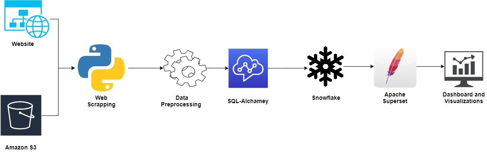
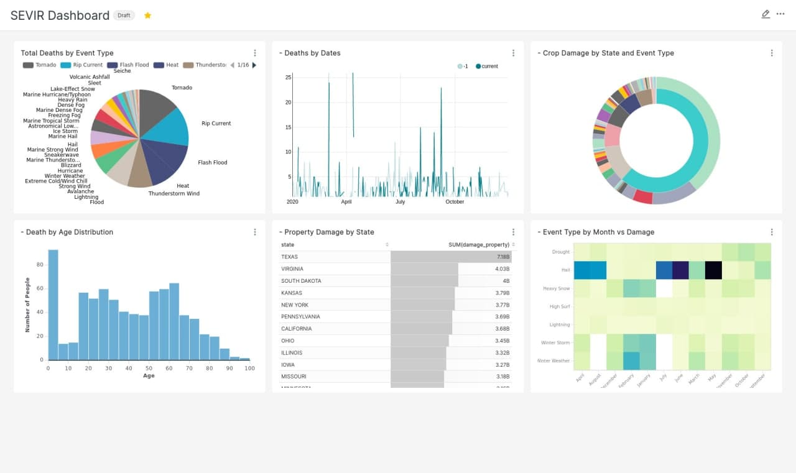

# CSYE7245 - Part 3 Snowflake and Apache Superset


[](https://www.python.org/)

**Team Members**<br />
Akash M Dubey <br />
Jayshil Jain <br />
Sagar Shah <br/>

#### Quick Links

##### Presentations <br />
[Google Docs](https://docs.google.com/document/d/1cTtzbRmLHuAwBRRGuP6TRDicmfXV97SV03Zlh9VtTWE/edit#heading=h.ejimkgfvmpx9)<br />
[CLAAT presentation](https://codelabs-preview.appspot.com/?file_id=1cTtzbRmLHuAwBRRGuP6TRDicmfXV97SV03Zlh9VtTWE#0)<br />


---

## Table of Contents

- [Introduction](#introduction)
- [Setup](#setup)
- [TestCases](#testcases)


## Introduction

SEVIR Snowflake Data Architecture is build to make sample SEVIR data available for everyone with detailed analysis over Apache Superset.

SEVIR Snowflake Architecture supports end to end cycle, right from copying the data from Public S3 sevir data to final analysis on Apache Superset, Data flows right from public Snowflake Tables. The data is scraped from the public website that gives information about the historical storm events. (https://registry.opendata.aws/noaa-goes/)

The scrapaed data is then preprocessed using Python and a schema is created for Snowflake Tables that are conneted to Python using SQL Alchamey and snowflake.connector.
The data is then loaded into the Snowflake Tables which is then connected to the Apache Superset that is powered by the Snowflake Database to create visualizations.


#### Dataset overview: 

The Storm EVent ImagRy (SEVIR) dataset is a collection of temporally and spatially aligned images containing weather events captured by satellite and radar. This dataset was created using publically available datasets distributed by NOAA, including the GOES-16 geostationary satellite, and data derived from NEXRAD weather radars, both of which are available on the Registry of Open Data on AWS 


## Architecture 



---


## Setup

The project requires: 

- Snowflake acoount
- Apache Superset Setup 
- Apache Airflow setup version setup
- Pycharm Community Edition
- Python 3.5+ setup:
- Libraries: snowflake.connector, h5py, PIL, matplotlib, write_pandas, SQLAlchemy, pandas, numpy, Beautiful Soup


Create a new account with snowflake: (https://signup.snowflake.com/)

Setup a login ID and password and note down the region and account information for the configuration.

Install Apache Superset refering the documets: https://superset.apache.org/docs/installation/installing-superset-using-docker-compose

Install Apache Airflow refering the documets: https://airflow.apache.org/docs/apache-airflow/stable/installation.html

Install Apache Airflow refering the documets: https://www.jetbrains.com/pycharm/download/#section=linux


### Clone

Clone this repo to your local machine using 
```
https://github.com/akash/AWSARCHITECHTURE.git 
```
 

### Setup Snowflake with Python

##### Install the snowflake.connector library 

```shell 
pip3 install snowflake.connector
```
##### Fill in the details from snowflake into the StormData.py file

```shell
ctx = sf.connect(
    user = 'xxx',
    password = 'xxx',
    account = 'xxx.aws',
    warehouse = 'xxx',
    database = 'xxx',
    schema = 'xxx'
)
cs = ctx.cursor()
```

### Configuration for Apache Superset 

##### Creating virtual environment using for Apache Superset on port 8088:

```shell

# Create an admin user (you will be prompted to set a username, first and last name before setting a password)
$ export FLASK_APP=superset
superset fab create-admin

# Load some data to play with
superset load_examples

# Create default roles and permissions
superset init

# To start a development web server on port 8088, use -p to bind to another port
superset run -p 8088 --with-threads --reload
```

##### Go into the browser locahost:8088 and run the Apache Superset

1. Go into the Data/Databases and add a new Database
2. Enter the Name of the Database
3. Enter the SQL Alchamey for the Database in the format 'snowflake://<user_login_name>:<password>@<account_name>'
4. After a connection is established go to Datasets and select all the tables required for the analytics and creating the dashboard
5. Use SQL lab to query and check the data is in the right format
6. Go to Charts and create dashboards that derive some meaningful insights




##### Install Apache Airflow

```
AIRFLOW_VERSION=2.0.1
PYTHON_VERSION="$(python --version | cut -d " " -f 2 | cut -d "." -f 1-2)"
# For example: 3.6
CONSTRAINT_URL="https://raw.githubusercontent.com/apache/airflow/constraints-${AIRFLOW_VERSION}/constraints-${PYTHON_VERSION}.txt"
# For example: https://raw.githubusercontent.com/apache/airflow/constraints-2.0.1/constraints-3.6.txt
pip install "apache-airflow==${AIRFLOW_VERSION}" --constraint "${CONSTRAINT_URL}"

# initialize the database
airflow db init

airflow users create \
    --username admin \
    --firstname Peter \
    --lastname Parker \
    --role Admin \
    --email spiderman@superhero.org

# start the web server, default port is 8080
airflow webserver --port 8080

# start the scheduler
# open a new terminal or else run webserver with ``-D`` option to run it as a daemon
airflow scheduler

# visit localhost:8080 in the browser and use the admin account you just
# created to login. Enable the example_bash_operator dag in the home pag
```


## Testcases

#### Run the Snowflake_SQL_Queries_to_Test_Data_and_Analytics.sql file and run the following queries to make sure the tables are configured properly

```
//Query 1 to select total death by the states//
SELECT STATE, 
        SUM(DEATHS_DIRECT) AS TOTAL_DEATHS
FROM DETAILS
GROUP BY STATE
ORDER BY TOTAL_DEATHS DESC

//Query 2 to select total death by the states//
SELECT  d.EVENT_TYPE,  
        COUNT(d.EVENT_ID) as Number_of_Fatalites
FROM DETAILS d
INNER JOIN FATALITY f ON d.EVENT_ID = f.EVENT_ID
GROUP BY d.EVENT_TYPE
ORDER BY Number_of_Fatalites DESC
```

